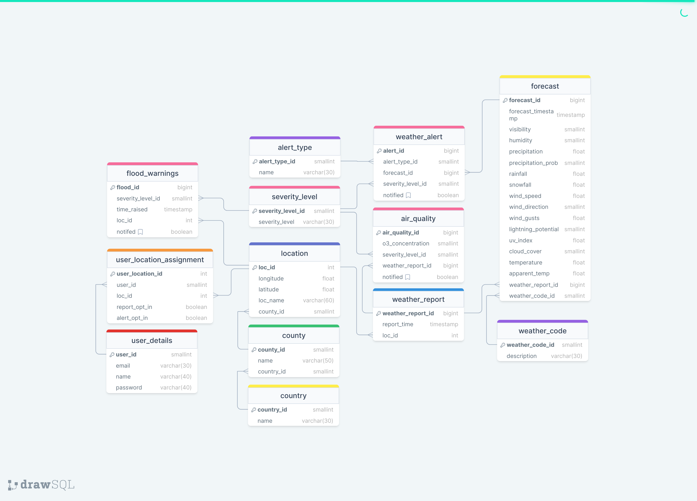
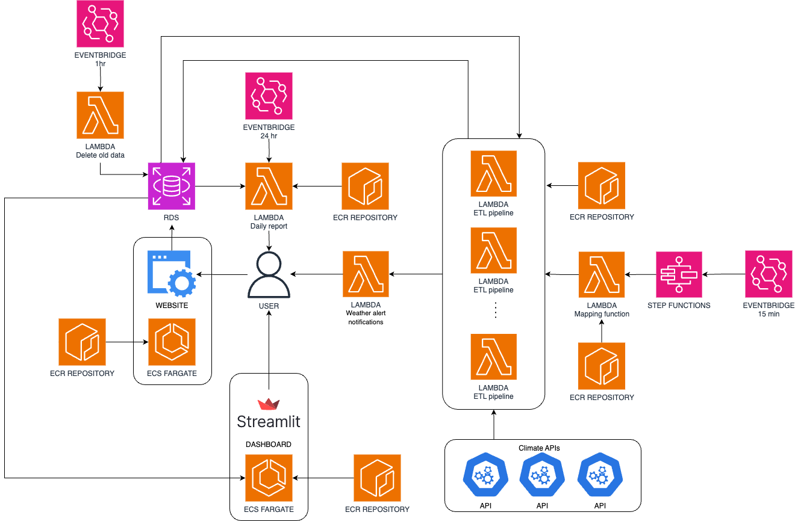

# Climate Monitor

## Introduction

Climate Monitor is a centralised platform designed to enhance the way users interact with climate-related data. Our system provides real-time updates on weather conditions, flood warnings, air quality, and temperature forecasts through a user-friendly interface. This helps users make informed decisions about their safety and activities based on accurate and up-to-date climate information.

## Problem Statement

Climate Monitor aims to solve the problem of accessing disparate sources for climate data by providing a unified platform. This allows users to receive climate data for specific locations and notifications about significant changes in climate conditions, enhancing safety and decision-making processes.

## Elevator Pitch

No more scrambling between disparate sources for weather updates. Climate Monitor consolidates temperature forecasts, rainfall patterns, flood warnings, and air quality metrics into one user-friendly interface, offering real-time notifications when weather conditions veer into dangerous territory.

## Installation

### Cloud Services

To create the cloud services infrastructure, run `bash create_infrastructure.sh` within the `terraform/` folder. It will need a `.tfvars` file with the following variables:
- `AWS_KEY`
- `AWS_SKEY`
- `DB_PORT`
- `DB_USER`
- `DB_PASSWORD`
- `DB_NAME`
- `SENDER_EMAIL`
- `REGION`
- `WEATHER_WARNING_TABLE`
- `FLOOD_WARNING_TABLE`
- `AIR_QUALITY_TABLE`

A separate `.env` file is also needed for installation and the creation of the cloud infrastructure. The variables should match the corresponding variables in the `.tfvars` file. The following variables are needed:
- `DB_PORT`
- `DB_USER`
- `DB_PASSWORD`
- `DB_NAME`

## Data Sources

- **UK Environment Agency APIs**: For flood monitoring and water quality feeds.
- **OpenMeteo Weather APIs**: For current and historical weather information.
- **Air Quality API**: For recent air quality data.
- **Defra website**: For daily air quality information.

## Proposed Solution & Functionality

- **Location Tracking**: Users can submit locations to be tracked for weather patterns and quality.
- **Dashboard**: View a list of all tracked locations and their weather conditions.
- **Notifications**: Receive alerts within a reasonable timeframe about potential hazards.
- **Reports**: Subscribe to receive daily weather and air quality reports for specified areas.

## Planned Outputs

- **Interactive Website/API**: Allows users to submit new locations for tracking.
- **Data Dashboard**: Explore data on tracked locations.
- **Automated Notification Service**: Alerts for hazards and emergencies.
- **Daily Summary Reports**: Regular updates for different locations.

## Tools & Technology Stack

- **Python** (including libraries)
- **AWS**
- **Docker**, **Terraform**

All tools chosen optimise for cost, complexity, and scalability.

## The outlined ERD for our project

## The architecture diagram

## Installation Guide

To install and run this software , this you will need to do three things in this order:
1. Setup the Amazon Web Services, with Terraform
2. 